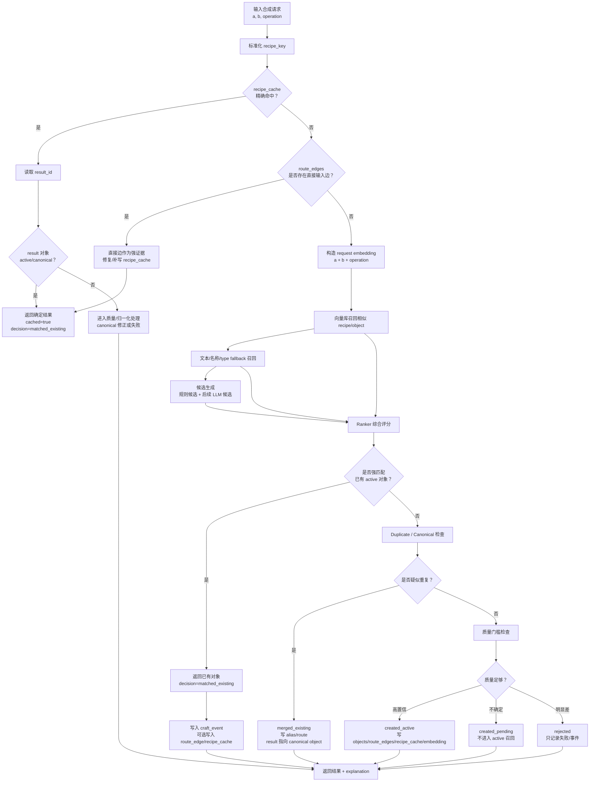

# MySynthesizer 合成器引擎实现设计

## 1. 目标

最终目标是写一个本地可运行的合成器引擎：

```text
输入：两个待合成对象 + operation(add/subtract)
输出：合成后的对象 + 命中/新建判断 + 可解释过程
```

后端使用 Python 实现。这个引擎不是简单调用前端 `POST /api/craft` 的封装，而是把当前设计文档中反推出来的合成流程工程化，形成一套可测试、可调参、可替换模型的完整 pipeline。

第一版目标是行为相似，而不是完全复刻线上后端。真实 prompt、检索算法和阈值不可见，因此实现应保留可观察证据、评分明细和调参入口。

## 1.1 当前实现范围与进展

当前阶段只实现核心合成器引擎，不做线上 API 适配和 FastAPI 服务层。

本阶段交付物：

- [x] Python 包内的数据模型和引擎模块。
- [x] 可从本地图谱加载对象、路线和 recipe cache 的轻量 SQLite 存储层。
- [x] `craft()` 核心流程：校验、标准化、特征抽取、候选生成、召回、评分、决策、保存结果。
- [x] CLI 或脚本级入口，用于单次合成、route 回放评估和 fake embedding 生成。
- [x] 可解释合成结果、失败记录和评估报告。
- [x] 测试看护脚本：`python -B scripts/run_tests.py`。
- [~] 向量化基础层已实现到 SQLite sidecar 和 fake provider，真实向量检索后置。
- [ ] 质量治理、状态过滤、真实 LLM 候选生成、HTTP/API 适配。

明确后置：

- 前端 API 兼容层。
- 线上 `GET /api/objects/{id}` adapter。
- FastAPI/HTTP 服务。
- 真实数据库、用户系统、权限和 cookie 处理。

## 2. 参考接口

线上前端合成接口：

```http
POST /api/craft
Content-Type: application/json
Cookie: hc_session=...
```

请求体：

```json
{
  "ingredient_ids": [1, 35],
  "operation": "add"
}
```

响应体核心结构：

```json
{
  "success": true,
  "result": {
    "id": 252,
    "name": "水龙卷",
    "emoji": "🌪️",
    "type": "element",
    "description": null,
    "character_summary": null,
    "background": null,
    "specialty": null,
    "weakness": null,
    "source": "llm",
    "is_banned": false,
    "ban_reason": null,
    "banned_at": null,
    "banned_by_user_id": null,
    "first_discoverer_id": 17,
    "first_discoverer_nickname": "Gloaming",
    "created_at": "2026-06-30T11:04:56.139361Z",
    "discovered_at": "2026-07-06T16:04:26.843809Z",
    "discovery_method": "recipe_cache",
    "is_first_discoverer": false,
    "category_ids": []
  },
  "failure_reason": null,
  "cached": true,
  "new_discovery": true,
  "first_discovery": false,
  "plaza_craft_remaining_today": null
}
```

对象详情接口：

```http
GET /api/objects/{id}
```

本地图谱中的对象字段与该响应基本一致，并可能额外内联 `craft_sources`。因此引擎内部应以完整对象为输入，而不是以 id 为输入。id 查询只属于外部 adapter。

后续做 API 适配时，可以把接口拆成两层：

- `POST /api/craft`：核心合成接口，接收两个完整对象。
- `POST /api/craft/by-ids`：兼容接口，接收 id，由后端 adapter 取对象详情后再调用核心引擎。

当前阶段不实现这两层 HTTP 接口，只保留它们作为未来适配方向。

## 3. 系统边界

### 3.1 外部 API Adapter

职责：

- 根据 `ingredient_ids` 拉取对象详情。
- 把线上对象转换为引擎内部 `SynthObject`。
- 可选：把本地引擎结果转换回前端类似响应格式。
- 不在 adapter 内做合成推理。

### 3.2 Core Engine

职责：

- 接收两个 `SynthObject` 和一个 `operation`。
- 执行标准化、特征抽取、候选生成、检索、评分、决策和结果构造。
- 返回结构化 `CraftResult`。

### 3.3 Object Store

职责：

- 提供已有对象库查询。
- 提供 route/craft_sources 查询。
- 支持从 `outputs/data/current/mysynthesizer_mine_full_routes_latest.json` 加载离线图谱。
- 支持把本地新合成结果保存到嵌入式 SQLite 数据库。
- 通过 `ObjectStore` 接口隔离持久化实现，后续可替换为 Postgres、MongoDB、向量库或线上 API。

### 3.4 当前轻量存储方案

当前工程不依赖外部数据库服务。默认采用 SQLite：它是单文件嵌入式数据库，不需要单独部署，但提供事务、唯一约束、索引和结构化查询，适合当前轻量工程。

JSON/JSONL 仍保留为导入导出和审计格式：

- 从 `outputs/data/current/mysynthesizer_mine_full_routes_latest.json` 导入基础图谱。
- 可导出 `objects.json` 方便人工检查和版本归档。
- 可选写入 `craft_events.jsonl` 作为追加审计日志，记录每次本地 craft 的输入、输出和评分。

推荐目录：

```text
data/
  engine/
    mysynth.db
    exports/
      objects.json
      route_edges.jsonl
    logs/
      craft_events.jsonl
      failures.jsonl
    meta.json
```

SQLite 表职责：

- `objects`：对象主表，保存完整 `SynthObject` 的稳定字段。
- `object_payloads`：对象原始 JSON 载荷，用于保留未知字段和兼容线上结构。
- `route_edges`：合成边，记录 `a_id/b_id/operation/result_id`。
- `recipe_cache`：规范化 recipe key 到 result id 的缓存。
- `craft_events`：本地每次 craft 的输入、候选、评分、决策和输出。
- `failures`：失败合成和异常输入，用于调试。
- `meta.json`：当前数据版本、下一个本地 id、生成时间、来源图谱路径。

写入策略：

1. 首次启动时从 `outputs/data/current/mysynthesizer_mine_full_routes_latest.json` 初始化 SQLite。
2. 后续启动优先读取 `data/engine/mysynth.db`，除非显式执行重新导入。
3. 新建对象时分配本地负 id，避免和线上正整数 id 冲突。
4. 每次本地 craft 成功后，在一个事务内写入 `objects`、`route_edges`、`recipe_cache` 和 `craft_events`。
5. craft 失败时写入 `failures`，并保留足够上下文用于复现。
6. 导出 JSON/JSONL 时使用快照，不作为主写入路径。

内存索引：

- `objects_by_id: dict[int | str, SynthObject]`
- `name_index: dict[str, set[id]]`
- `token_index: dict[str, set[id]]`
- `type_index: dict[SynthType, set[id]]`
- `recipe_index: dict[RecipeKey, id]`
- `neighbors_by_object: dict[id, set[id]]`

SQLite schema 应保持窄表 + JSON payload 的折中：

```text
objects(id, name, normalized_name, type, description, source, is_banned, created_at, discovered_at)
object_payloads(object_id, payload_json)
route_edges(id, a_id, b_id, operation, result_id, source)
recipe_cache(recipe_key, a_id, b_id, operation, result_id, created_at)
craft_events(id, request_json, result_json, score_json, created_at)
failures(id, request_json, reason, context_json, created_at)
```

迁移原则：

- `ObjectStore` 接口不能暴露 SQLite 细节。
- 业务逻辑只依赖 `ObjectStore`，不直接写 SQL。
- SQLite 实现命名为 `SQLiteObjectStore`。
- 如果后续换 Postgres/MongoDB/向量库，只新增 store 实现，不改 engine pipeline。
- embedding 或全文检索可以作为 side index 接入，不替代主对象库。

## 4. Python 数据模型

### 4.1 SynthObject

```python
from typing import Literal

from pydantic import BaseModel, Field


SynthType = Literal["element", "item", "equipment", "creature", "concept"]
Operation = Literal["add", "subtract"]
Decision = Literal["matched_existing", "created_new", "failed"]


class SynthObject(BaseModel):
    id: int | None = None
    name: str
    emoji: str | None = None
    type: SynthType
    description: str | None = None
    character_summary: str | None = None
    background: str | None = None
    specialty: str | None = None
    weakness: str | None = None
    source: str | None = None
    is_banned: bool = False
    ban_reason: str | None = None
    banned_at: str | None = None
    banned_by_user_id: int | None = None
    first_discoverer_id: int | None = None
    first_discoverer_nickname: str | None = None
    created_at: str | None = None
    discovered_at: str | None = None
    discovery_method: str | None = None
    is_first_discoverer: bool = False
    category_ids: list[int] = Field(default_factory=list)
```

### 4.2 CraftRequest

```python
class CraftOptions(BaseModel):
    allow_banned: bool = False
    match_threshold: float = 0.78
    review_threshold: float = 0.62
    max_candidates: int = 10
    use_llm: bool = False
    explain: bool = True


class CraftRequest(BaseModel):
    operation: Operation
    ingredient_a: SynthObject
    ingredient_b: SynthObject
    options: CraftOptions = Field(default_factory=CraftOptions)
```

### 4.3 CandidateObject

候选对象是生成阶段的中间产物，不一定会成为最终对象。

```python
class CandidateObject(BaseModel):
    name: str
    type: SynthType
    description: str
    emoji: str | None = None
    core_tags: list[str] = Field(default_factory=list)
    anchors: list[str] = Field(default_factory=list)
    source_reason: str
```

### 4.4 CraftResult

```python
class ScoreBreakdown(BaseModel):
    semantic_similarity: float = 0.0
    name_similarity: float = 0.0
    anchor_bonus: float = 0.0
    type_compatibility_bonus: float = 0.0
    route_prior_bonus: float = 0.0
    contradiction_penalty: float = 0.0
    over_generic_penalty: float = 0.0
    total: float = 0.0


class CraftResult(BaseModel):
    success: bool
    result: SynthObject | None = None
    failure_reason: str | None = None
    decision: Decision
    cached: bool = False
    candidate: CandidateObject | None = None
    matched_object_id: int | None = None
    score_breakdown: ScoreBreakdown | None = None
    explanation: str
```

## 5. Pipeline

### 5.1 Validate

检查内容：

- `operation` 必须是 `add` 或 `subtract`。
- 两个输入对象必须有 `name` 和合法 `type`。
- banned 对象默认不可参与合成，除非 options 显式允许。
- description 为空时仍可合成，但应降低语义置信度。

### 5.2 Normalize

标准化内容：

- 去除首尾空白。
- 统一中英文符号。
- 保留专名大小写和特殊标点，例如 `BanG Dream!`、`MyGO!!!!!`。
- 将 null description 转为空字符串用于检索，但在对象输出中保留 null 语义。

### 5.3 Feature Extraction

从对象中抽取：

- `name_tokens`：名称词、专名、数字、符号专名。
- `semantic_tags`：自然物、职业、武器、舞台、音乐、角色、组织等。
- `anchors`：IP、角色、代表曲、国别、世界观词、品牌、系列名。
- `functions`：用途、能力、行为、装备功能。
- `materials`：物质、能量、组成。
- `constraints`：矛盾项、排除项、已剥离属性。

第一版可以用规则和词典实现；后续再接 LLM 或 embedding 模型。

### 5.4 Intent Planning

根据 type 组合和 operation 生成意图：

```text
add:
  融合 A/B 的物质、功能、身份、题材、世界观或文化锚点。

subtract:
  从 A 中移除 B 代表的属性、组成、用途、身份、武装、能源或题材。
```

Intent 至少包含：

- 预期输出 type。
- 主要保留项。
- 主要移除项。
- 应优先考虑的锚点。
- 是否偏向常识对象、专名对象或新概念。

### 5.5 Candidate Generation

候选生成器分两层：

1. 规则候选：根据 type 组合、关键词、已有 route 模式生成 3 到 10 个候选。
2. LLM 候选：用结构化 prompt 生成更自然的候选名、type、description 和解释。

第一版可以只实现规则候选 + 可插拔 LLM 接口。候选输出必须结构化，不能只返回一段自然语言。

### 5.6 Retrieval

用候选对象检索已有对象库：

- 名称精确匹配。
- 名称归一化匹配。
- description/tag 关键词召回。
- craft_sources 邻接召回：输入 A/B 附近的结果和来源对象。
- 可选 embedding 召回。

召回阶段宁可多取一些，最终由 ranker 决定。

### 5.7 Ranking

评分公式：

```text
score =
  semantic_similarity
  + name_similarity
  + anchor_bonus
  + type_compatibility_bonus
  + route_prior_bonus
  - contradiction_penalty
  - over_generic_penalty
```

评分项：

- `semantic_similarity`：候选定义与已有对象定义是否等价。
- `name_similarity`：名称是否同义、缩写、翻译或上下位关系。
- `anchor_bonus`：是否共享强排他锚点。
- `type_compatibility_bonus`：type 是否符合 intent。
- `route_prior_bonus`：已有 craft_sources 是否支持相邻路径。
- `contradiction_penalty`：描述中是否存在明确冲突。
- `over_generic_penalty`：候选是否被过泛对象吸附。

### 5.8 Decision

决策输出三类：

```text
强命中：返回已有对象，并记录 matched_existing。
弱命中：返回候选与 top matches，按配置决定是否新建。
无命中：创建新对象。
```

第一版建议使用可配置阈值：

```text
match_threshold = 0.78
review_threshold = 0.62
```

这些阈值不是线上真实阈值，只是本地实现的初始参数，必须通过回放数据校准。

### 5.9 New Object Construction

新对象字段生成规则：

- `name`：选择最自然、稳定、可命名的候选名。
- `type`：来自 intent/candidate/ranker 投票。
- `description`：必须解释 A/B 与 operation 如何得到结果。
- `emoji`：可由 type + name 规则或 LLM 生成。
- `source`：本地引擎可标记为 `local_engine`。
- `craft_sources`：记录本次 A/B/operation。

不要强行拼接名称，除非拼接本身就是最自然命名。

## 6. 当前引擎模块设计

### 6.1 模块结构

当前实现以 Python 包为核心，不依赖 HTTP 服务。建议结构：

```text
mysynth/
  __init__.py
  models.py
  engine.py
  store.py
  normalize.py
  features.py
  intent.py
  candidates.py
  retrieval.py
  ranking.py
  decision.py
  persistence.py
  evaluation.py
  cli.py
```

职责：

- `models.py`：Pydantic 数据模型。
- `engine.py`：编排完整 craft pipeline。
- `store.py`：对象库、路线库、recipe cache 的查询接口。
- `normalize.py`：名称、描述、符号、空值标准化。
- `features.py`：规则特征抽取。
- `intent.py`：根据输入 type 和 operation 生成合成意图。
- `candidates.py`：规则候选生成，后续接 LLM 候选生成器。
- `retrieval.py`：已有对象召回。
- `ranking.py`：候选与已有对象评分。
- `decision.py`：命中已有对象或创建新对象。
- `persistence.py`：SQLite 初始化、迁移、导入导出和审计日志。
- `evaluation.py`：route_edges 回放评估。
- `cli.py`：单次合成和评估命令。

### 6.2 纯引擎接口

```python
from typing import Protocol


class SynthesizerEngine(Protocol):
    def craft(self, request: CraftRequest) -> CraftResult:
        ...
```

### 6.3 Store 接口

```python
from typing import Iterable, Protocol


ObjectId = int | str
RecipeKey = tuple[ObjectId, ObjectId, Operation]


class ObjectStore(Protocol):
    def get_object(self, object_id: ObjectId) -> SynthObject | None:
        ...

    def list_objects(self) -> Iterable[SynthObject]:
        ...

    def find_recipe(self, key: RecipeKey) -> SynthObject | None:
        ...

    def search_candidates(self, candidate: CandidateObject, limit: int) -> list[SynthObject]:
        ...

    def save_craft_result(
        self,
        request: CraftRequest,
        result: CraftResult,
    ) -> None:
        ...
```

### 6.4 Engine 编排逻辑

```text
craft(request)
  -> validate(request)
  -> normalize(ingredient_a, ingredient_b)
  -> recipe_cache lookup
  -> extract_features(a, b)
  -> plan_intent(features, operation)
  -> generate_candidates(intent, features)
  -> retrieve_existing_objects(candidates, store)
  -> rank_matches(candidates, retrieved_objects)
  -> decide(best_match, best_candidate, thresholds)
  -> construct result
  -> store.save_craft_result(request, result)
  -> return CraftResult
```

关键规则：

- `add` 默认对称，recipe key 应规范化输入顺序；`subtract` 不对称，必须保留 A/B 顺序。
- 若 recipe cache 命中，直接返回缓存对象，同时 `cached=true`。
- 若已有对象强命中，返回已有对象，不改写已有 description。
- 若创建新对象，description 必须解释本次 A/B/operation。
- 本地新对象默认 `source="local_engine"`，`discovery_method="local_engine"`。
- 持久化失败时不应吞掉错误；引擎应返回失败或抛出受控异常，避免内存结果和磁盘结果不一致。

### 6.5 第一版候选生成逻辑

第一版不直接依赖 LLM。候选生成按规则产生可解释结果：

- 名称组合候选：`A+B`、`B+A`、核心词组合、上位词组合。
- 常识模板候选：自然物、装备、职业、组织、舞台、武器、能源等模板。
- 减法候选：保留 A 的物理壳、功能壳、抽象本质，移除 B 的属性。
- route 类比候选：从相同 type 组合和相邻对象路线中提取常见结果模式。
- 专名锚点候选：当输入含强锚点时，保留专名而不是泛化成题材词。

候选必须带 `source_reason`，否则不进入 ranking。

### 6.6 第一版召回和评分逻辑

召回顺序：

1. recipe cache 精确召回。
2. 名称精确或归一化召回。
3. 名称 token 召回。
4. description/tag 召回。
5. route 邻接召回。
6. type 相同对象补充召回。

评分初始权重：

```text
semantic_similarity:      0.30
name_similarity:          0.25
anchor_bonus:             0.15
type_compatibility_bonus: 0.12
route_prior_bonus:        0.10
contradiction_penalty:   -0.20
over_generic_penalty:    -0.10
```

第一版评分不追求复杂模型，优先做到：

- 每一项可解释。
- 每个 top match 能输出命中理由。
- 错误样本能定位是召回失败、候选失败、评分失败还是阈值失败。

### 6.7 CLI 草案

```bash
mysynth craft --a 1 --b 35 --operation add
mysynth craft --a-name 水 --b-name 风 --operation add
mysynth eval --routes outputs/data/current/mysynthesizer_mine_full_routes_latest.json
```

CLI 是当前阶段的主要交互面。HTTP/API 适配等核心引擎稳定后再做。

## 7. 评估方法

使用本地图谱的 `route_edges` 做回放：

```text
输入：a_id, b_id, operation
真实输出：result_id
引擎输出：predicted result
```

指标：

- exact id match：是否命中同一个对象。
- name match：名称是否一致或归一化一致。
- type match：type 是否一致。
- top-k match：真实结果是否进入候选 top k。
- decision accuracy：应命中已有对象时是否命中，应新建时是否新建。
- explanation quality：解释是否覆盖 A/B 和 operation。

评估集应按类型拆分：

- `concept + concept`
- `element + element`
- `concept + creature`
- `concept + equipment`
- `equipment + equipment`
- subtract 主要组合
- IP/专名锚点样本
- 常识物理样本

## 8. 实施阶段

### Phase 1：核心引擎骨架（已完成）

- 建立 `mysynth/` Python 包。
- 实现 `models.py`、`engine.py`、`store.py` 的最小闭环。
- 读取 `outputs/data/current/mysynthesizer_mine_full_routes_latest.json`。
- 建立 `objects_by_id`、`recipe_index`、`name_index`、`token_index`、`neighbors_by_object`。
- 支持 `craft(CraftRequest) -> CraftResult`。

验收：

- `python -B -m mysynth init --force` 可初始化本地库。
- `python -B -m mysynth craft --a 2 --b 3396 --operation add --no-persist` 可命中 recipe cache。

### Phase 2：SQLite 持久化（已完成）

- 创建 `data/engine/` 数据目录。
- 实现 `SQLiteObjectStore`。
- 初始化 `mysynth.db` schema。
- 从 `mysynthesizer_mine_full_routes_latest.json` 导入对象和路线。
- 实现 `objects`、`object_payloads`、`route_edges`、`recipe_cache`、`craft_events`、`failures` 表写入。
- 本地新对象使用负 id。
- 写入使用事务，保证对象、路线和 recipe cache 一致。

验收：

- 重复导入不会生成重复 route_edges。
- 本地新建对象能在同一事务中写入 object、route、recipe 和 craft_event。

### Phase 3：规则 pipeline（已完成第一版，仍需收窄召回）

- 实现 validate、normalize、feature extraction、intent planning。
- 实现规则候选生成。
- 实现 recipe cache、名称、token、description、直接输入边召回。
- 实现可解释评分和阈值决策。
- 支持新对象构造和保存。

注意：

- 不使用裸单边邻接对象作为通用召回来源。高频节点会污染候选。
- route 证据只保留直接输入边或经语义过滤后的 route 类比。
- 当前实现仍保留 `neighbors_by_object` 作为受限路线证据和 route prior，下一步应从候选召回里进一步剥离裸邻接扩散。

验收：

- 非缓存合成会返回 candidate、top_matches、score_breakdown 和 explanation。
- 召回错误、候选错误和阈值错误可以通过 craft_event 或评估失败样本定位。

### Phase 4：CLI 与回放评估（已完成第一版）

- 支持 CLI 单次合成。
- 支持按 `route_edges` 回放评估。
- 输出 exact id/name/type/top-k/decision 指标。
- 输出错误样本报告，区分候选失败、召回失败、评分失败和阈值失败。

验收：

- `python -B scripts/run_tests.py` 通过。
- `python -B -m mysynth eval --limit 20 --failures 10` 输出总体、分桶和失败样本。

### Phase 5：向量化基础层（已完成基础 sidecar，真实检索待接入）

- 新增 `EmbeddingProvider` 接口，负责生成 embedding。
- 新增 `EmbeddingStore` / `VectorIndex` 接口，隔离 SQLite sidecar 与未来向量库。
- SQLite 新增 `embeddings` 和 `embedding_jobs`。
- 为 object、recipe、candidate、request 定义稳定的 embedding text。
- embedding 记录必须包含 `owner_type`、`owner_id`、`text_hash`、`model`、`dimensions`、`status`、`vector_backend_id`。
- 当前默认使用 SQLite sidecar 记录 embedding 元数据；真实 ANN 检索后续可接 FAISS、hnswlib、Qdrant、Milvus 或 pgvector。

验收：

- 相同 embedding text + model 不重复生成。
- object description 更新后，旧 embedding 标记为 `stale`。
- recipe cache 命中时不调用 embedding 检索。

当前实现状态：

- 已新增 `mysynth/embeddings.py`，提供 `EmbeddingProvider`、fake provider、embedding text builder 和 SQLite embedding sidecar 写入。
- 已新增 `embeddings`、`embedding_jobs` 表。
- 已支持 `python -B -m mysynth embed objects --limit 100`。
- 已有测试覆盖同文本去重和文本变化 stale 标记。
- 尚未实现 ANN/vector top-k 召回，当前 fake vector 只用于验证流程和数据结构。

recipe/edge 向量化边界：

- `recipe_cache` 和 `route_edges` 仍是 `(a, b, operation) -> result` 的确定性主存储。
- recipe embedding 只用于召回相似历史合成经验，不替代精确 recipe lookup。
- 给定 `a, b, operation` 时，只有 `recipe_cache` 或直接 `route_edges` 命中才代表确定结果。
- 向量库返回的是“相似 recipe/object”，只能作为候选证据进入 ranker、LLM 或质量门槛。
- 向量库 payload 可以保存 `a_id`、`b_id`、`operation`、`result_id`、`status`，但这些字段只用于过滤和回查，不作为主事实来源。

### Phase 6：LLM 候选生成（未开始）

- 增加 `CandidateGenerator` 接口。
- 用结构化 prompt 生成候选。
- 保留规则候选作为 fallback。
- 对候选输出做 schema 校验。

验收：

- LLM 只生成候选，不直接绕过质量门槛写入 active 图。
- LLM 输出必须包含 name、type、description、source_reason。
- LLM 失败时可回退规则候选。

### Phase 7：混合检索与调参（未开始）

- 增加 embedding top-k 召回。
- 用 route_edges 做阈值校准。
- 输出错误样本报告，区分泛化吸附、专名缺失、type 错误和减法错误。

检索优先级：

```text
recipe exact cache
-> direct route evidence
-> vector top-k objects/recipes
-> text fallback
-> LLM candidate generation
-> local ranker / LLM rerank
```

确定性查询与相似召回流程：



验收：

- eval 输出 `vector_top_k_hit`、`llm_candidate_hit`、`hybrid_top5_hit`。
- 失败样本包含 vector matches、LLM candidates 和最终决策原因。
- recipe cache 命中时不会被 vector 相似结果覆盖。
- vector top-k 命中的 recipe 只能作为候选证据，不能直接返回为确定结果。

### Phase 8：只增图治理与索引维护（未开始，建议下一步）

- 主数据采用 append-friendly 策略，不默认物理删除对象和路线。
- `objects` 增加 `status`：`active / pending / rejected / merged / banned / archived`。
- `route_edges` 增加 `status`、`disabled_at`、`disabled_reason`。
- `embeddings` 增加 `status`：`active / stale / deleted`。
- 所有在线召回默认只读取 `active` 对象、路线和 embedding。
- 增加维护命令：
  - `rebuild-index`：从 active 数据重建内存索引和向量 side index。
  - `compact`：归档旧 craft_events/failures，清理 stale/deleted embedding。

验收：

- banned/rejected/merged 对象不会进入默认 craft 召回。
- 评估和审计可通过显式参数读取 inactive 数据。
- compact 不影响 active recipe cache 命中。

### Phase 9：质量治理与归一化（未开始，建议优先前置实现最小闭环）

- 新增合成结果状态：
  - `accepted`：可进入 active 图。
  - `pending`：暂存，等待二次确认或审核。
  - `rejected`：不采用，只保留事件。
  - `merged`：归并到 canonical object。
- 新增质量字段：`quality_score`、`quality_flags`、`canonical_id`、`review_reason`。
- 新增表：
  - `object_aliases(alias, object_id, source, created_at)`
  - `quality_reviews(object_id, status, flags, reviewer, note, created_at)`
  - `canonical_groups(group_id, canonical_object_id)`
- 入库前增加 duplicate/canonical check。
- 默认新对象先进入 `pending`，只有通过质量门槛或人工确认才进入 active 图。

坏结果分类：

- `bad_name`：名称奇怪或不稳定。
- `weak_reasoning`：description 无法解释输入来源。
- `type_mismatch`：type 与输入意图冲突。
- `duplicate_risk`：疑似已有对象别名或近似重复。
- `retrieval_error`：错误召回带偏结果。
- `llm_generation_error`：LLM 输出结构或语义不合格。

验收：

- 高重复风险结果不会创建 active 新对象。
- merged 结果会写入 alias 和 route，但 result 指向 canonical object。
- pending 对象默认不参与后续合成和向量召回。

当前建议：

- 质量治理应提前到真实 LLM/真实向量检索之前做最小版本，避免低质量或重复对象污染 active 图。
- 最小版本至少包括对象 `status`、`canonical_id`、`quality_flags`、duplicate/canonical check、active-only 召回。

### Phase 10：API 兼容层（未开始）

- 提供 `POST /api/craft` 核心接口，接收完整 objects。
- 提供 `POST /api/craft/by-ids` 兼容接口，接收 `ingredient_ids`。
- 响应格式以 `CraftResult` 为准，保留线上前端响应中的关键对象字段。

验收：

- API 层不直接访问 SQLite，只调用 engine 和 store 接口。
- API 返回结果不泄漏内部评估、审核和 embedding 字段，除非 debug 模式显式开启。

## 8.1 向量化与百万级规模建议

Python 继续作为主编排语言，不建议当前切换到 C++/Rust 重写主引擎。

性能边界：

- Python 不做百万级向量暴力循环。
- Python 不承担完整大图的在线重型遍历。
- 向量检索、ANN 索引、批量相似度和图算法应落到原生库或外部服务。
- SQLite 继续作为主元数据仓库；高维向量检索不由 SQLite 自己承担。

推荐演进：

1. Python + SQLite + embedding 接口。
2. 本地 FAISS/hnswlib 向量索引。
3. 数据和并发增长后切换 Qdrant/Milvus/pgvector。
4. 如果图拓扑分析变重，接 Neo4j GDS 或独立 graph service。
5. 只有 Python 编排本身成为瓶颈时，再把热路径拆成 Rust/C++ 服务。

核心原则：

- `ObjectStore`、`EmbeddingStore`、`VectorIndex`、`CandidateGenerator`、`Ranker` 都必须是接口。
- 替换底层存储或向量库不能改 engine pipeline。
- recipe 应作为一等实体向量化，而不是只把对象节点向量化。
- recipe 向量化的目标是相似召回，不是替代 `recipe_cache` / `route_edges` 的精确映射。

## 8.2 只增图与删除语义

主图可以只增不减，但在线检索视图不能无条件只增不减。

删除语义分三层：

- 物理删除：默认不用，只在维护/压缩中处理无引用垃圾数据。
- 逻辑删除：通过 `status` 或 `is_banned` 标记，不破坏历史事件和评估。
- 索引删除：从 active text/vector/graph index 中移除，不参与在线合成。

性能影响：

- SQLite 主表只增通常可接受。
- Python 内存索引需要按 active 数据重建，避免长期累积 inactive 节点。
- 向量索引必须支持 tombstone 和 compaction，否则质量和检索成本都会下降。
- route_edges 可长期保留，但在线 route evidence 只读取 active edges。

## 8.3 合成质量治理

LLM 生成结果不能直接污染 active graph。

最终写入流程：

```text
generate candidates
-> retrieve possible canonical objects
-> LLM generate result
-> duplicate/canonical check
-> quality gate
-> decision:
   matched_existing
   merged_existing
   created_pending
   created_active
   rejected
```

默认策略：

- recipe cache 命中：返回 active/canonical 对象。
- 高置信匹配已有对象：`matched_existing`。
- 高重复相似度：`merged_existing`，不新建 active 对象。
- 质量不确定：`created_pending`，不进入 active 召回。
- 明显坏结果：`rejected`，只记录事件。

质量评分维度：

- `name_quality`
- `description_quality`
- `source_consistency`
- `type_confidence`
- `duplicate_risk`
- `specificity`

质量门槛：

- `duplicate_risk` 高：不创建 active 新对象。
- `type_confidence` 低：pending。
- `source_consistency` 低：pending 或 rejected。
- `specificity` 低：pending，避免泛概念污染图。

## 8.4 阶段评估看板

| 阶段 | 核心目标 | 可量化指标 |
|---|---|---|
| Phase 1-2 | 最小引擎和 SQLite 闭环 | init/craft/eval/test 全通过 |
| Phase 3-4 | 规则 pipeline 与评估 | exact/name/type/top-k/decision 分桶输出 |
| Phase 5 | 向量化基础 | embedding 去重率、stale 检测、任务失败率 |
| Phase 6 | LLM 候选 | schema 合格率、fallback 率、candidate hit |
| Phase 7 | 混合检索 | vector top-k hit、hybrid top5 hit、错误分布 |
| Phase 8 | 只增图治理 | active index 大小、compact 后一致性、inactive 泄漏数 |
| Phase 9 | 质量治理 | pending/rejected/merged 比例、重复对象下降率 |
| Phase 10 | API 兼容 | 线上响应兼容率、错误返回稳定性 |

## 9. 与现有设计文档的关系

`mysynthesizer-synthesizer-design.md` 继续作为机制分析和行为模型入口。

本文负责实现边界、数据模型、pipeline、接口和评估方法。后续修改时应避免把产品/实现细节混回机制分析文档。

## 10. 注意事项

- 不把真实 session cookie 写入仓库。
- 不把前端 API 当作本地引擎的唯一输入形态。
- 不假设线上真实阈值已知。
- 不用大范围模糊匹配替代强锚点判断。
- 所有“像线上”的判断都必须能通过 route_edges 回放评估。
